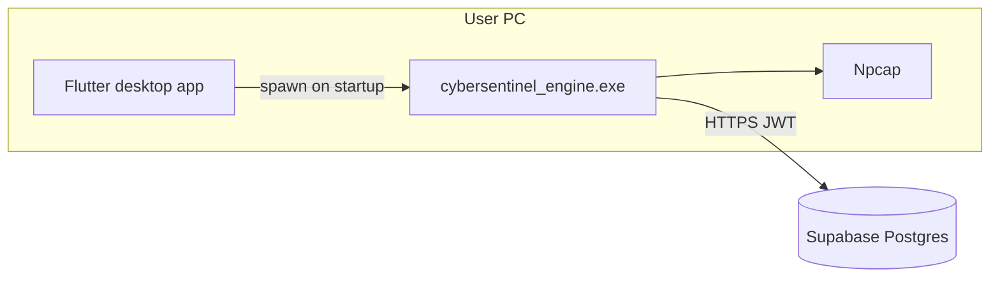

# Desktop packaging — Flutter + local backend

CyberSentinel is a **thick client**: the Flutter UI runs on the user's PC, and a **local FastAPI engine** handles packet capture, ML inference, and talks to **Supabase** in the cloud. Users install one `.exe` installer; they never install Python.

## Architecture



| Component | Where it runs | Role |
|-----------|---------------|------|
| Flutter app | User machine | UI, login, dashboards |
| `cybersentinel_engine.exe` | User machine (bundled) | API, capture, ML |
| Supabase | Cloud | Shared database per user (`user_id`) |

The engine binds to **`127.0.0.1:8000`** only — not exposed to the internet.

---

## Step 1 — Build the engine (backend team)

From the repo root on **Windows** with Python 3.12:

```powershell
cd packaging\windows
.\build_engine.ps1
```

This produces:

```
packaging/windows/dist/CyberSentinelEngine/
  cybersentinel_engine.exe
  engine.env                    ← edit before shipping
  supervised_learning/models/
  unsupervised_learning/models/
  _internal/                    ← PyInstaller deps
```

### Configure `engine.env` (before installer)

Copy `engine.env.example` → `engine.env` in that folder and set:

- `DATABASE_URL` — your Supabase pooler URL
- `JWT_SECRET_KEY` — same secret everywhere (local engine + any cloud API)
- `DEFAULT_ADMIN_PASSWORD` — change from default

**Do not commit real `engine.env` to git.**

---

## Step 2 — Flutter: start engine on app launch

Copy `backend_launcher.dart` from your Flutter project (`lib/services/backend_launcher.dart`) — or use the copy already in:

```
C:\Users\hamma\OneDrive\Desktop\New folder\lib\services\backend_launcher.dart
```

Copy the **entire** `CyberSentinelEngine` folder to:

```
your_flutter_app/windows/runner/engine/
```

So dev runs look like:

```
windows/runner/engine/cybersentinel_engine.exe
```

### Wire into `main.dart`

```dart
import 'services/backend_launcher.dart';

Future<void> main() async {
  WidgetsFlutterBinding.ensureInitialized();
  await BackendLauncher.instance.start();
  runApp(const MyApp());
}
```

Use a **single API base URL** everywhere:

```dart
const apiBaseUrl = BackendLauncher.apiBaseUrl; // http://127.0.0.1:8000
```

Login: `POST $apiBaseUrl/api/v1/auth/token` with `username` = email, `password` = password.  
Send `Authorization: Bearer <token>` on all other calls.

### Stop engine on exit (optional)

In your app lifecycle / window close handler:

```dart
await BackendLauncher.instance.stop();
```

---

## Step 3 — Build Flutter Windows release

```bash
flutter build windows --release
```

Output: `build/windows/x64/runner/Release/`

---

## Step 4 — Create one installer (Inno Setup)

1. Install [Inno Setup](https://jrsoftware.org/isinfo.php).
2. Install [Npcap](https://npcap.com) on target machines (or bundle Npcap's silent installer in `[Run]` — requires Npcap license acceptance).

```powershell
# From packaging\windows after build_engine.ps1 and flutter build
iscc installer.iss /DFLUTTER_BUILD="C:\path\to\flutter_app\build\windows\x64\runner\Release"
```

Installed layout:

```
C:\Program Files\CyberSentinel\
  cybersentinel.exe          ← Flutter
  data\                      ← Flutter assets
  engine\
    cybersentinel_engine.exe
    engine.env
    supervised_learning\...
```

`BackendLauncher` resolves `engine/` next to the installed `.exe` automatically.

---

## Admin / capture requirements

- **Run as Administrator** for live packet capture and firewall monitoring.
- **Npcap** must be installed (Wireshark installer includes it).
- Without admin/Npcap, the app still works for login, dashboard, and uploaded PCAP — only live capture fails.

---

## Development vs production

| Mode | Backend | Database |
|------|---------|----------|
| Dev (you) | `uvicorn main:app` in `cybersentinel-backend/` | `.env` → Supabase or SQLite |
| Desktop user | `cybersentinel_engine.exe` auto-started by Flutter | `engine.env` → Supabase |

---

## CI note

GitHub Actions can run `build_engine.ps1` on `windows-latest` and upload `CyberSentinelEngine` as an artifact. Flutter CI builds the UI; a final job assembles the Inno Setup installer.

---

## Security notes

- `JWT_SECRET_KEY` in `engine.env` is embedded in the installer — acceptable for FYP; for production consider per-install secrets or OAuth.
- Never ship your personal `.env` from `cybersentinel-backend/`.
- Engine listens on localhost only (`HOST=127.0.0.1`).

---

## Troubleshooting

| Problem | Fix |
|---------|-----|
| Engine not found | Ensure `engine/` folder is copied next to Flutter `.exe` |
| Health check timeout | Check `engine.env` DATABASE_URL; run `cybersentinel_engine.exe` manually in a terminal |
| Capture fails | Run app as Admin; install Npcap |
| Wrong user's data | JWT `sub` must match — each login gets isolated `user_id` rows |

---

# Linux desktop packaging

Same thick-client model: Flutter UI + `cybersentinel_engine` + Supabase.

| Artifact | Path |
|----------|------|
| Build engine | `packaging/linux/build_engine.sh` |
| PyInstaller spec | `packaging/linux/cybersentinel_engine.spec` |
| Tar.gz installer | `packaging/linux/bundle_release.sh` |
| User install wizard | `packaging/linux/install.sh` |
| Full docs | `packaging/linux/README.md` |

Flutter project scripts:

```bash
./scripts/sync_engine.sh
./scripts/prepare_release_linux.sh
```

Engine binary name on Linux: **`cybersentinel_engine`** (no `.exe`).

Capture: **libpcap** + **`setcap cap_net_raw,cap_net_admin+eip`** on the engine (handled by `install.sh` and first-launch `pkexec` in the app).
